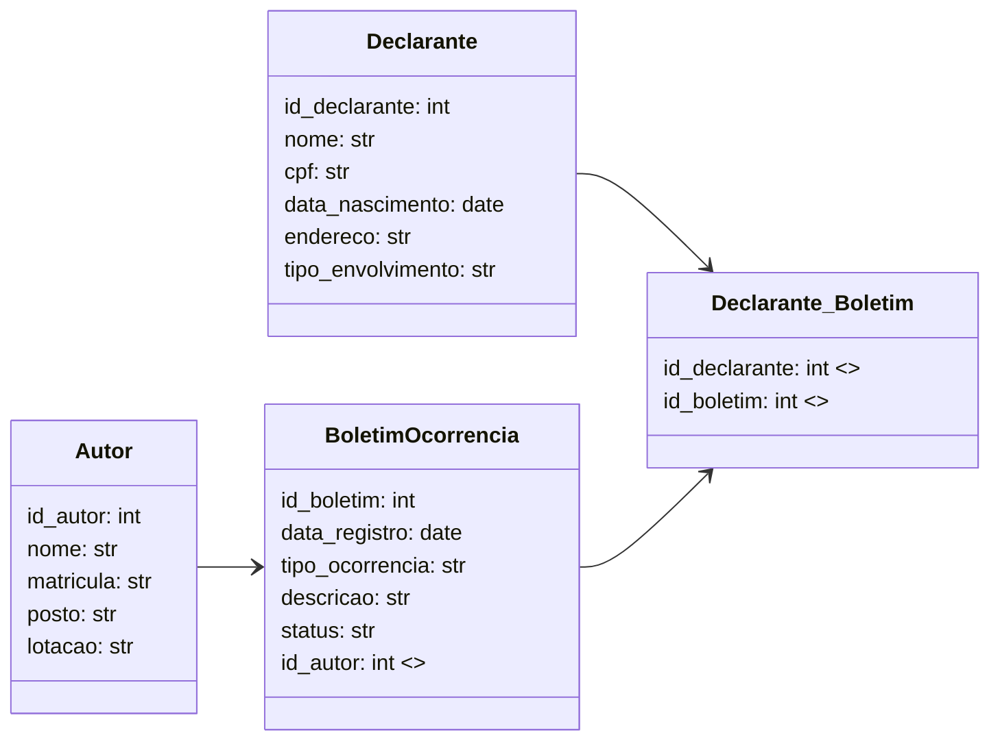

# BoletimOcorrencias

## Como rodar o projeto
 - clone o repositorio
 - crie um ambiente virtual chamado ".venv"
    ```bash
    python -m venv .venv
    ```
- entre no ambiente virtual
    ```bash
    source .venv/bin/activate
    ```
- baixe as dependências para rodar o projeto
    ```bash
    pip install -r requirements.txt
    ```
- navege para a pasta boletim_ocorrencias
- inicie o projeto
    ```bash
    fastapi dev boletim_ocorrencias/main.py
    ```
- para gerar 1000 dados fictícios
    ```bash
    python -m boletim_ocorrencias.scripts.generate_data
    ```
## IMPORTANTE
 - toda vez que baixar alguma coisa, atualize o requirements.txt
    ```bash
    pip freeze > requirements.txt
    ```


## MODELAGEM 


